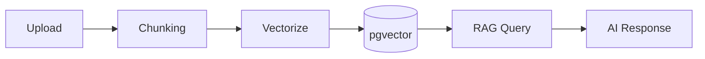

# KEngine Architecture

## Services

- **postgres**: PostgreSQL 16 + pgvector for data and vector embeddings
- **redis**: Queue and cache backend
- **app**: Laravel 12 application serving Web UI + REST API
- **queue**: Processes AI generation and knowledge processing tasks
- **scheduler**: Triggers scheduled tasks every 60 seconds

## Data Flow

```
Upload Documents → Auto Chunking → Vector Embedding → pgvector Store
    → RAG Retrieval → AI Generation → Review → Publish → Archive
```

## Knowledge Processing Pipeline



## Security

- All service ports bound to 127.0.0.1
- Secrets via environment variables only
- No external network access for internal services
- Encrypted storage for API credentials
