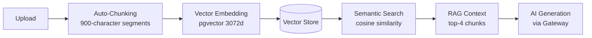
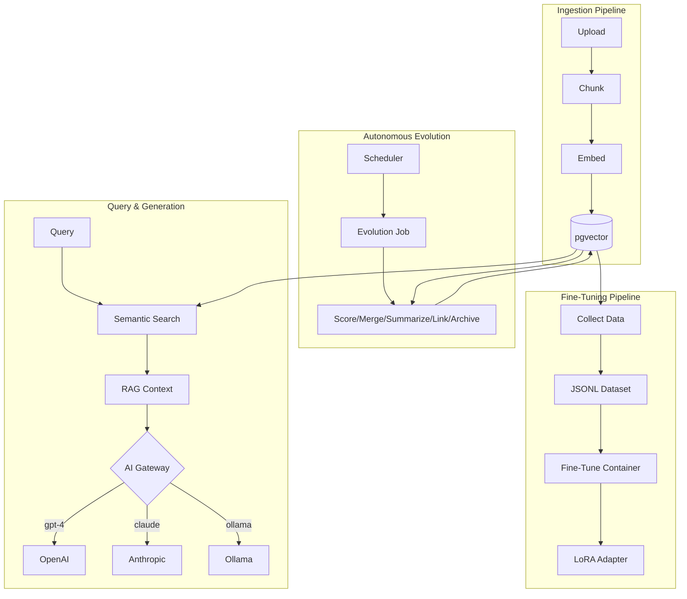

<p align="center">
  <picture>
    <source media="(prefers-color-scheme: dark)" srcset="https://img.shields.io/badge/KEngine-Knowledge%20Engine-4F8FF7?style=for-the-badge&logo=readme&logoColor=white">
    
  </picture>
  
  
  
  
  
</p>

<p align="center">
  <b>English</b> · <a href="README_CN.md">中文</a>
</p>

<h1 align="center">KEngine</h1>
<p align="center"><b>Enterprise-Grade, Self-Hosted Knowledge Engine</b></p>
<p align="center"><i>Multi-Provider AI · Autonomous Evolution · Local Fine-Tuning · Full Data Sovereignty</i></p>

<p align="center">
  <a href="#-overview">Overview</a> •
  <a href="#-core-capabilities">Capabilities</a> •
  <a href="#-architecture">Architecture</a> •
  <a href="#-quick-start">Quick Start</a> •
  <a href="#-configuration">Configuration</a>
</p>

---

## 📋 Overview

**KEngine** transforms your documents into a living, AI-augmented knowledge asset — fully self-hosted, entirely private. It is an enterprise-grade knowledge base platform that combines automated document processing, vector-powered semantic search, Retrieval-Augmented Generation (RAG), and a multi-provider AI gateway into a single, deploy-once infrastructure.

Unlike single-provider knowledge tools, KEngine provides **vendor-independent AI orchestration**: connect any combination of cloud LLMs (OpenAI, Anthropic, Google, DeepSeek, and more) and local inference engines (Ollama, LM Studio, vLLM) through a unified gateway. Your knowledge base evolves autonomously, improving content quality over time. And with built-in fine-tuning pipeline, you can adapt open-source models to your domain — all within your infrastructure.

**Data never leaves your network. API keys never touch your code. Every AI call is auditable.**

### Target Audiences

| Role | Value |
|------|-------|
| **Enterprise Teams** | Private knowledge hub with RAG, multi-model governance, full audit trail |
| **AI/ML Engineers** | Unified gateway to evaluate and compare 15+ providers; LoRA fine-tuning on domain data |
| **Content Operations** | Automated content pipeline with semantic retrieval, evolution, and multi-site distribution |
| **Privacy-First Organizations** | 100% self-hosted, encrypted API key storage, zero external data leakage |
| **Quantitative Teams** | Structured knowledge base feeding into quantitative models and trading agents |

---

## 🚀 Core Capabilities

### 1. Universal AI Gateway

A **vendor-independent routing layer** that decouples your knowledge operations from any single AI provider. All requests pass through `ai-gateway:19090` and are dispatched to the optimal provider based on model name prefix — no code changes needed when switching providers.

| Category | Providers | Connection |
|----------|-----------|------------|
| **Cloud LLMs** | OpenAI, Anthropic Claude, Google Gemini, DeepSeek, Azure OpenAI, AWS Bedrock | Internet |
| **Chinese Cloud** | SiliconFlow, Zhipu AI (GLM), Moonshot/Kimi, Alibaba Qwen, Baidu Qianfan | Internet |
| **Local Engines** | Ollama, LM Studio, vLLM, LocalAI, llama.cpp | `host.docker.internal` |
| **Custom** | Any OpenAI-compatible endpoint | Configurable |

```
┌──────────────┐     ┌─────────────────────────────────────┐
│  GEOFlow     │────▶│        AI Gateway (:19090)           │
│  (Laravel)   │     │                                     │
└──────────────┘     │  gpt-*    ──▶ OpenAI                │
                     │  claude-* ──▶ Anthropic              │
                     │  gemini-* ──▶ Google                 │
                     │  deepseek* ─▶ DeepSeek               │
                     │  ollama/* ──▶ Ollama (local)         │
                     │  *          ─▶ Custom providers      │
                     └─────────────────────────────────────┘
```

**Key benefits:**
- **Provider failover**: If one provider fails, auto-route to backup models by priority
- **Cost optimization**: Route inexpensive models for simple tasks, premium models for complex ones
- **Local-first**: Use local models for sensitive data, cloud models for peak capacity
- **Unified observability**: Single endpoint for all AI usage metrics and audit logging

### 2. Knowledge Base & RAG Pipeline

Full-cycle document ingestion and retrieval:



- **Smart chunking**: Paragraph-aware segmentation with configurable overlap
- **Dual retrieval**: pgvector native search + in-memory hybrid scoring (vector 75% + lexical 25%)
- **Embedding fallback**: Hash-based pseudo-vectors when no embedding API is available
- **Batch vectorization**: 12 chunks per embedding call with automatic retry

### 3. Autonomous Knowledge Evolution

Knowledge bases degrade without maintenance. KEngine's **evolution engine** acts as an automated curator, running on a configurable schedule:

| Phase | Operation | Description |
|-------|-----------|-------------|
| 1. **Score** | Quality Assessment | AI evaluates each chunk on quality, relevance, and freshness (0–1 scale) |
| 2. **Merge** | Deduplication | Jaccard similarity detects near-duplicate chunks; flags for review |
| 3. **Summarize** | Compression | Long chunks (>500 chars) receive AI-generated concise summaries |
| 4. **Link** | Cross-Reference | Cosine similarity across embedding vectors discovers semantic connections |
| 5. **Archive** | Lifecycle Management | Low-quality, stale chunks (90d+ no access) auto-archived |

```bash
make evolve-run              # Manual trigger
make evolve-status           # Last run summary
```

### 4. Local Model Fine-Tuning

Transform your knowledge base into a **domain-adapted model** through LoRA/QLoRA fine-tuning:

```
Knowledge Chunks ──▶ CollectTrainingData ──▶ JSONL Dataset
                           │
                    Alpaca / ShareGPT format
                           │
                    ┌──────▼──────┐
                    │ Fine-Tune   │  Unsloth (preferred) or PEFT
                    │ Container   │  GPU-accelerated (CUDA 12.1+)
                    └──────┬──────┘
                           │
                    ┌──────▼──────┐
                    │ LoRA Adapter│  deployable to vLLM / Ollama
                    └─────────────┘
```

Three methods: **LoRA** (fast, low memory), **QLoRA** (4-bit quantized, minimal GPU), **Full** (maximum adaptation).

```bash
make fine-tune-collect       # Build training dataset from KB
make fine-tune-start         # Launch training
make fine-tune-logs          # Monitor real-time loss & metrics
```

---

## 🏗️ Architecture

### System Topology

| Service | Layer | Port | Dependencies |
|---------|-------|------|-------------|
| **postgres** | Data | 15432 | PostgreSQL 16 + pgvector |
| **redis** | Cache | 16379 | Queue broker, session store |
| **app** | Application | 18080 | Laravel 12, Web UI, REST API |
| **queue** | Worker | — | AI generation, knowledge processing |
| **scheduler** | Orchestration | — | Cron triggers, evolution dispatch |
| **ai-gateway** | **AI** | **19090** | **FastAPI, multi-provider router** |
| **fine-tune** | **AI** | — | **Unsloth/PEFT, GPU required** |

### Data Flow



All services bind to `127.0.0.1`. Internal services (database, queue) have no external ports. API keys encrypted at rest with AES-256-CBC.

---

## ⚡ Quick Start

### Prerequisites
- Docker 24+, Docker Compose 2.20+, Git 2.30+
- At least one AI provider API key (any provider)

### Installation

```bash
git clone https://github.com/justmicos/kengine.git
cd kengine
make dev-setup
# Edit .env — set at least one AI provider key
make dev-up
```

Windows:
```powershell
.\scripts\setup.ps1
# Edit .env
docker compose up -d
```

Open **http://localhost:18080/admin**

### Provider Configuration

Choose the deployment mode that fits your infrastructure:

**A) AI Gateway — Multi-Provider (Recommended)**
```env
AI_GATEWAY_ENABLED=true
OPENAI_API_KEY=sk-...           # Cloud provider
OLLAMA_BASE_URL=http://host.docker.internal:11434  # + local if desired
```
```bash
make dev-up-gateway
```

**B) Local-Only (Air-Gapped)**
```env
AI_GATEWAY_ENABLED=true
OLLAMA_BASE_URL=http://host.docker.internal:11434
OLLAMA_MODEL=qwen2.5:72b
EMBEDDING_PROVIDER=ollama
```

**C) Direct Provider (Single Provider)**
```env
AI_GATEWAY_ENABLED=false
AI_API_KEY=sk-...
AI_API_URL=https://api.deepseek.com/v1
AI_MODEL=deepseek-chat
```

---

## 📖 Command Reference

### Service Lifecycle

```bash
make dev-setup           # Initialize: clone GEOFlow, create .env
make dev-up              # Start core (app, db, redis, queue, scheduler)
make dev-up-all          # Start all services (core + gateway + fine-tune)
make dev-up-gateway      # Start core + AI gateway
make dev-down            # Stop all services
make dev-logs            # Tail all service logs
make dev-status          # Container status overview
```

### AI Gateway Operations

```bash
make ai-gateway-logs             # Tail gateway logs
make ai-gateway-test             # Interactive chat completion test
make ai-gateway-test-embedding   # Test embedding endpoint
make ai-gateway-list-models      # List all available models
```

### Knowledge Evolution

```bash
make evolve-run                  # Manual evolution cycle
make evolve-status               # View last 5 evolution run summaries
```

### Fine-Tuning Pipeline

```bash
make fine-tune-collect           # Extract training data from knowledge base
make fine-tune-start             # Launch fine-tuning container
make fine-tune-logs              # Monitor training progress
make fine-tune-list-jobs         # List completed model adapters
```

### Maintenance

```bash
make backup                      # Full database dump
make build                       # Rebuild all Docker images
make privacy-check               # Scan for credential leaks
make clean                       # Purge temp data (docker-data, backups)
```

---

## 🔧 Configuration

### Core Application

| Variable | Default | Description |
|----------|---------|-------------|
| `APP_PORT` | `18080` | Web UI and REST API port |
| `SITE_NAME` | `KEngine` | Application display name |
| `POSTGRES_PASSWORD` | `geo_password` | Database password |
| `DB_EXPOSE_PORT` | `15432` | PostgreSQL host port (127.0.0.1 only) |

### AI Providers

Configured via `.env`. All provider keys are optional — configure only what you use.

| Variable | Provider | Default Model |
|----------|----------|---------------|
| `OPENAI_API_KEY` | OpenAI | `gpt-4o` |
| `ANTHROPIC_API_KEY` | Anthropic Claude | `claude-sonnet-4-20250514` |
| `GEMINI_API_KEY` | Google Gemini | `gemini-2.5-pro` |
| `DEEPSEEK_API_KEY` | DeepSeek | `deepseek-chat` |
| `AZURE_OPENAI_KEY` + `AZURE_OPENAI_ENDPOINT` | Azure OpenAI | `gpt-4o` |
| `SILICONFLOW_API_KEY` | SiliconFlow | `deepseek-ai/DeepSeek-V3` |
| `ZHIPU_API_KEY` | Zhipu AI | `glm-4-plus` |
| `MOONSHOT_API_KEY` | Moonshot | `moonshot-v1-8k` |
| `QWEN_API_KEY` | Alibaba Qwen | `qwen-max` |
| `OLLAMA_BASE_URL` | Ollama | `qwen2.5:72b` |
| `LMSTUDIO_BASE_URL` | LM Studio | `qwen2.5-72b-gguf` |
| `VLLM_BASE_URL` | vLLM | `qwen2.5-72b-instruct` |
| `LOCALAI_BASE_URL` | LocalAI | `llama-3.1-8b-instruct` |
| `LLAMACPP_BASE_URL` | llama.cpp | `qwen2.5-72b-q4km` |

### Embedding Model

| Variable | Default | Options |
|----------|---------|---------|
| `EMBEDDING_PROVIDER` | `openai` | `openai`, `deepseek`, `ollama` |
| `EMBEDDING_MODEL` | `text-embedding-3-small` | Provider-specific model ID |

### Autonomous Evolution

| Variable | Default | Description |
|----------|---------|-------------|
| `EVOLUTION_ENABLED` | `true` | Enable scheduled evolution |
| `EVOLUTION_INTERVAL_HOURS` | `24` | Run interval |
| `EVOLUTION_MODEL` | `deepseek-chat` | AI model for quality assessment |
| `EVOLUTION_MAX_CHUNKS_PER_RUN` | `50` | Batch size per cycle |
| `EVOLUTION_SIMILARITY_THRESHOLD` | `0.85` | Cosine threshold for duplicate detection |
| `EVOLUTION_AUTO_PRUNE` | `true` | Auto-archive stale, low-quality chunks |
| `EVOLUTION_AUTO_MERGE` | `true` | Flag near-duplicate chunks |
| `EVOLUTION_AUTO_SUMMARIZE` | `true` | Generate summaries for long chunks |
| `EVOLUTION_AUTO_LINK` | `true` | Create cross-reference links |
| `EVOLUTION_AUTO_ARCHIVE_DAYS` | `90` | Archive chunks unaccessed for N days |

### Fine-Tuning

| Variable | Default | Description |
|----------|---------|-------------|
| `FINE_TUNE_ENABLED` | `false` | Enable pipeline |
| `FINE_TUNE_BASE_MODEL` | `Qwen/Qwen2.5-7B-Instruct` | HuggingFace base model |
| `FINE_TUNE_METHOD` | `lora` | `lora`, `qlora`, or `full` |
| `FINE_TUNE_R` | `16` | LoRA rank |
| `FINE_TUNE_ALPHA` | `32` | LoRA scaling parameter |
| `FINE_TUNE_EPOCHS` | `3` | Training epochs |
| `FINE_TUNE_BATCH_SIZE` | `4` | Per-device batch size |
| `FINE_TUNE_LEARNING_RATE` | `2e-4` | Peak learning rate |
| `FINE_TUNE_DATASET_MAX_SAMPLES` | `1000` | Maximum training samples |

---

## 📦 Project Structure

```
kengine/
├── ai-gateway/                 # Multi-provider AI routing layer
│   ├── server.py               # FastAPI application, OpenAI-compatible API
│   ├── router.py               # Model-prefix → provider resolution
│   ├── config.py               # Environment-based provider configuration
│   ├── providers/
│   │   ├── base.py             # Abstract provider interface
│   │   ├── openai_compatible.py # OpenAI, DeepSeek, Ollama, vLLM, etc.
│   │   ├── anthropic.py        # Claude Messages API translator
│   │   └── google.py           # Gemini API translator
│   └── Dockerfile
├── fine-tune/                  # Local model fine-tuning pipeline
│   ├── fine_tune.py            # Orchestrator: Unsloth → PEFT fallback
│   ├── dataset.py              # JSONL loader, Alpaca/ShareGPT formatting
│   ├── recipes/lora.yaml       # Default training recipe
│   └── Dockerfile
├── patches/                    # GEOFlow application extensions
│   ├── app/
│   │   ├── Jobs/EvolutionJob.php
│   │   ├── Console/Commands/EvolutionCommand.php
│   │   ├── Console/Commands/CollectTrainingDataCommand.php
│   │   └── Services/GeoFlow/KnowledgeEvolutionService.php
│   └── config/geoflow.php
├── config/                     # Nginx, target site agent
├── scripts/                    # Cross-platform setup & maintenance
│   ├── setup.sh / setup.ps1    # One-click deploy
│   ├── apply-patches.sh/.ps1   # GEOFlow enhancement patcher
│   ├── backup.sh               # Database dump
│   └── health-check.sh         # Service availability probe
├── seed/                       # Example knowledge base
├── .env.example                # Complete configuration template
├── docker-compose.yml          # Service orchestration (7 services)
├── Makefile                    # Command hub
└── ARCHITECTURE.md             # System design document
```

---

## 📄 License

MIT License — see [LICENSE](LICENSE) for full text.

---

<p align="center">
  <sub>Built on <a href="https://github.com/yaojingang/GEOFlow">GEOFlow</a> · Self-hosted · Private · MIT Licensed</sub>
</p>
