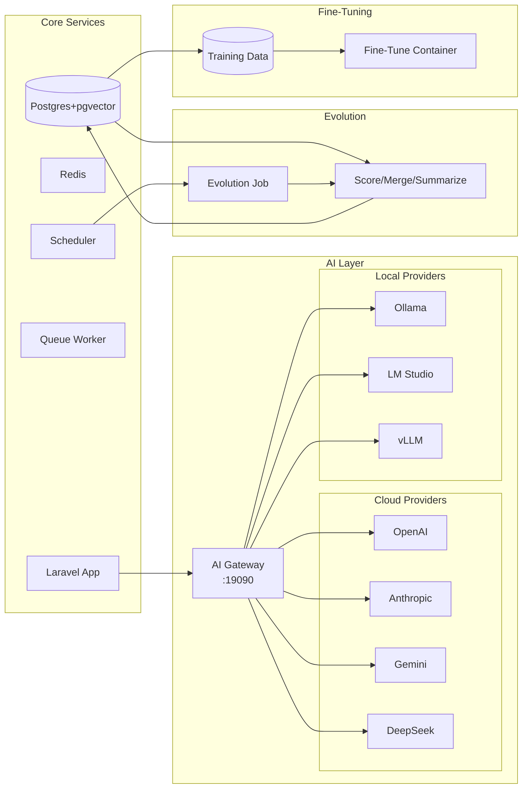

<p align="center">
  
  
  
  
  
  
</p>

<p align="center">
  <b>English</b> · <a href="README_CN.md">中文</a>
</p>

<h1 align="center">KEngine</h1>
<p align="center"><b>Open-Source Knowledge Base Platform</b></p>
<p align="center"><i>Upload. Organize. Search. Ask. — Your private, self-hosted knowledge engine powered by AI.</i></p>

---

## What is KEngine?

KEngine is a self-hosted, open-source knowledge base platform that transforms your documents into a searchable, AI-augmented knowledge asset. Upload your files, and KEngine automatically processes, chunks, vectorizes, and indexes them — ready for semantic search and AI-powered Q&A.

Your data stays on your infrastructure. Always.

### Why KEngine?

| Problem | Solution |
|---------|----------|
| Scattered documents | Centralized knowledge base with auto-categorization |
| Hard to find information | Semantic search understands meaning, not keywords |
| Manual processing | Auto-chunking and vectorization pipeline |
| Privacy concerns | 100% self-hosted, data never leaves your network |
| **Limited AI providers** | **Support all mainstream LLMs + local models** |
| **Static knowledge** | **Auto-evolution improves content over time** |

---

## v2.1 New Features

### 🔄 Multi-Provider AI Support

Support **all mainstream LLM providers** — not just DeepSeek:

| Provider | Type | Model Examples |
|----------|------|---------------|
| OpenAI | Cloud | gpt-4o, gpt-4o-mini, o1, o3-mini |
| Anthropic | Cloud | claude-sonnet-4, claude-opus-4, claude-haiku |
| Google | Cloud | gemini-2.5-pro, gemini-2.0-flash |
| DeepSeek | Cloud | deepseek-chat, deepseek-reasoner |
| Azure | Cloud | gpt-4o (Azure) |
| AWS Bedrock | Cloud | claude-sonnet-4-v2 |
| SiliconFlow | Cloud | DeepSeek-V3, Qwen2.5 |
| Zhipu AI | Cloud | GLM-4+, CogView |
| Moonshot/Kimi | Cloud | moonshot-v1-8k |
| Alibaba Qwen | Cloud | qwen-max, qwen-turbo |
| Baidu Qianfan | Cloud | ERNIE 4.0 |
| **Ollama** | **Local** | **qwen2.5, llama3.1, deepseek-r1** |
| **LM Studio** | **Local** | **Any GGUF model** |
| **vLLM** | **Local** | **Any HuggingFace model** |
| **LocalAI** | **Local** | **llama.cpp-compatible models** |
| **llama.cpp** | **Local** | **Any GGUF model** |

Two modes:
- **AI Gateway mode** (recommended): AI requests go through `ai-gateway:19090`, which auto-routes to the correct provider based on model name prefix
- **Direct mode**: GEOFlow's built-in database-driven provider resolution (existing)

### 🧠 Knowledge Auto-Evolution

Your knowledge base **improves itself over time**:
- **Quality Scoring**: AI evaluates content quality, relevance, and freshness
- **Deduplication**: Detects and flags duplicate/similar chunks
- **Summarization**: Auto-generates concise summaries for long content
- **Cross-Referencing**: Discovers and links related knowledge chunks
- **Stale Archiving**: Archives low-quality, unused content after configurable days

Configured via `.env`:
```env
EVOLUTION_ENABLED=true
EVOLUTION_INTERVAL_HOURS=24
EVOLUTION_MODEL=deepseek-chat
EVOLUTION_AUTO_MERGE=true
EVOLUTION_AUTO_SUMMARIZE=true
```

### 🔧 Local Model Fine-Tuning

Fine-tune local LLMs using your knowledge base content:
- **LoRA/QLoRA/Full fine-tuning** via Unsloth (preferred) or PEFT
- **Collects training data** from knowledge base chunks
- **GPU-accelerated** training in Docker
- **Exports LoRA adapters** for deployment

```bash
make fine-tune-collect      # Collect training data from knowledge base
make fine-tune-start         # Start fine-tuning
make fine-tune-logs          # Monitor progress
make fine-tune-list-jobs     # List completed fine-tuning jobs
```

---

## Quick Start

### Prerequisites
Docker 24+, Docker Compose 2.20+, Git 2.30+, AI API Key (any provider)

### Install
```bash
git clone https://github.com/justmicos/geo-engine.git
cd geo-engine
make dev-setup
# Edit .env -> set at least one AI provider (see .env.example)
make dev-up
```

Windows:
```powershell
.\scripts\setup.ps1
# Edit .env to set at least one AI provider
docker compose up -d
```

Open http://localhost:18080/admin

### Configure AI Provider
Choose one of these approaches:

**A) AI Gateway (recommended)**: Edit `.env`:
```env
AI_GATEWAY_ENABLED=true
DEEPSEEK_API_KEY=sk-xxx  # or any other provider
make dev-up-gateway       # Start core + AI Gateway
```

**B) Direct model**: Edit `.env`:
```env
AI_GATEWAY_ENABLED=false
AI_API_KEY=sk-xxx                    # For DeepSeek
AI_API_URL=https://api.deepseek.com/v1
AI_MODEL=deepseek-chat
```

**C) Local model**: Edit `.env`:
```env
AI_GATEWAY_ENABLED=true
OLLAMA_BASE_URL=http://host.docker.internal:11434
OLLAMA_MODEL=qwen2.5:72b
EMBEDDING_PROVIDER=ollama
```

---

## Commands

```bash
make dev-setup           # Setup and configure
make dev-up              # Start services (core)
make dev-up-all          # Start all services (core + AI Gateway + fine-tune)
make dev-up-gateway      # Start core + AI Gateway only
make dev-down            # Stop all services
make dev-logs            # View logs
make dev-status          # Service status
make backup              # Backup database
make privacy-check       # Privacy scan

# AI Gateway
make ai-gateway-logs         # View AI Gateway logs
make ai-gateway-test         # Test chat completion
make ai-gateway-test-embedding  # Test embeddings
make ai-gateway-list-models  # List available models

# Knowledge Evolution
make evolve-run              # Manually trigger evolution
make evolve-status           # Show last evolution run

# Fine-Tuning
make fine-tune-collect       # Collect training data
make fine-tune-start         # Start fine-tuning
make fine-tune-logs          # Monitor progress
make fine-tune-list-jobs     # List completed jobs

# Build
make build                   # Build all Docker images
```

## Architecture



### System Services

| Service | Port | Role |
|---------|------|------|
| kengine-postgres | 15432 | PostgreSQL 16 + pgvector |
| kengine-redis | 16379 | Cache and queue |
| kengine-app | 18080 | Web UI + REST API |
| kengine-queue | - | Knowledge processing worker |
| kengine-scheduler | - | Task scheduler & evolution |
| **kengine-ai-gateway** | **19090** | **Multi-provider AI proxy** |
| **kengine-fine-tune** | - | **Fine-tuning (on demand)** |

## Configuration

See [`.env.example`](.env.example) for the complete configuration reference.

### Core

| Variable | Required | Default | Description |
|----------|----------|---------|-------------|
| AI_API_KEY | No | - | AI provider API key (direct mode) |
| AI_API_URL | No | https://api.deepseek.com/v1 | AI API endpoint (direct mode) |
| AI_MODEL | No | deepseek-chat | Model name (direct mode) |
| APP_PORT | No | 18080 | Web UI port |

### AI Gateway

| Variable | Required | Default | Description |
|----------|----------|---------|-------------|
| AI_GATEWAY_ENABLED | No | false | Enable AI Gateway routing |
| OPENAI_API_KEY | No* | - | OpenAI API key |
| ANTHROPIC_API_KEY | No* | - | Anthropic Claude API key |
| GEMINI_API_KEY | No* | - | Google Gemini API key |
| DEEPSEEK_API_KEY | No* | - | DeepSeek API key |
| OLLAMA_BASE_URL | No* | http://host.docker.internal:11434 | Ollama endpoint |

*\*At least one provider must be configured.*

### Evolution

| Variable | Default | Description |
|----------|---------|-------------|
| EVOLUTION_ENABLED | true | Enable auto-evolution |
| EVOLUTION_INTERVAL_HOURS | 24 | How often to run |
| EVOLUTION_MODEL | deepseek-chat | Model for evolution tasks |
| EVOLUTION_AUTO_MERGE | true | Auto-merge similar chunks |
| EVOLUTION_AUTO_SUMMARIZE | true | Auto-generate summaries |

### Fine-Tuning

| Variable | Default | Description |
|----------|---------|-------------|
| FINE_TUNE_ENABLED | false | Enable fine-tuning |
| FINE_TUNE_BASE_MODEL | Qwen/Qwen2.5-7B-Instruct | Base model |
| FINE_TUNE_METHOD | lora | lora, qlora, or full |
| FINE_TUNE_R | 16 | LoRA rank |
| FINE_TUNE_EPOCHS | 3 | Training epochs |

## Project Structure

```
geo-engine/
├── ai-gateway/           # Multi-provider AI routing proxy
│   ├── server.py         # FastAPI server
│   ├── router.py         # Model-based routing
│   ├── config.py         # Provider config from .env
│   ├── providers/        # Provider implementations
│   │   ├── base.py
│   │   ├── openai_compatible.py
│   │   ├── anthropic.py
│   │   └── google.py
│   └── Dockerfile
├── fine-tune/            # Local model fine-tuning pipeline
│   ├── fine_tune.py      # Training orchestrator
│   ├── dataset.py        # Dataset handling
│   ├── recipes/          # Training recipes
│   └── Dockerfile
├── patches/              # GEOFlow source patches
│   ├── app/
│   │   ├── Jobs/EvolutionJob.php
│   │   ├── Console/Commands/
│   │   └── Services/GeoFlow/KnowledgeEvolutionService.php
│   └── config/geoflow.php
├── config/               # Nginx, target site
├── scripts/              # Setup, backup, health-check
├── seed/                 # Seed data
├── .env.example          # All provider configs
├── docker-compose.yml    # All services
└── Makefile              # All commands
```

## License

MIT License
