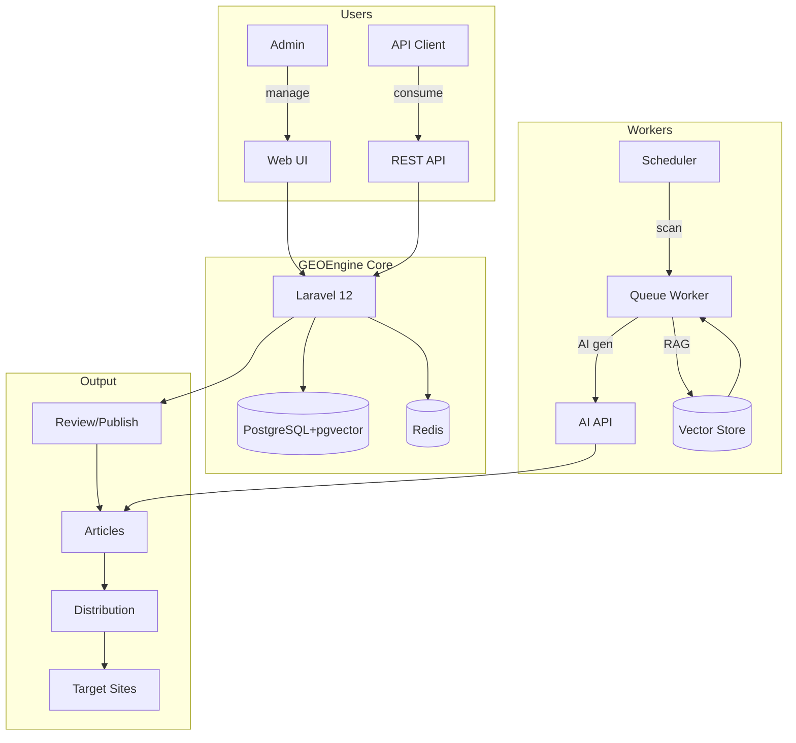
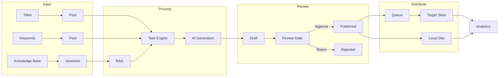
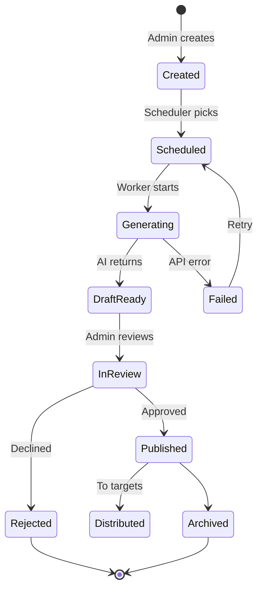

<p align="center">
  
  
  
  
  
</p>

<p align="center"><b>English</b> · <a href="README_CN.md">中文</a></p>
<p align="center"><b>GEO Content Engineering Infrastructure</b></p>
<p align="center"><i>Knowledge → Generate → Distribute → Analyze — Transform trusted knowledge into publishable, distributable, trackable GEO content assets.</i></p>

---

## Overview

GEOEngine is a production-ready deployment kit for GEOFlow, the leading open-source GEO content engineering platform. It orchestrates the entire content lifecycle — from knowledge ingestion and AI generation through review, multi-site distribution, and performance analytics — into one cohesive system that runs 100% on your infrastructure.

### System Architecture



### Pipeline Overview



### Task Lifecycle



---

## Quick Start

```bash
# Clone and setup
git clone https://github.com/justmicos/geo-engine.git
cd geo-engine
make dev-setup
# Edit .env -> set AI_API_KEY (required)
make dev-up

# Verify
make dev-status
open http://localhost:18080/geo_admin
```

## Features

| Area | Capabilities |
|------|-------------|
| Knowledge Engine | Upload docs, auto-chunk, pgvector, RAG retrieval |
| Content Factory | Title/keyword/image libraries, AI generation, review pipeline |
| Distribution | Channel management, Agent protocol, WordPress integration |
| Analytics | System overview, per-site ops, distribution tracking, AI crawler detection |

## Commands

```bash
make dev-setup     # One-click setup
make dev-up        # Start services
make dev-down      # Stop services
make dev-logs      # Follow logs
make backup        # Backup database
make restore FILE=x  # Restore from backup
make privacy-check # Privacy leak scan
```

## Configuration

| Variable | Required | Default | Description |
|----------|----------|---------|-------------|
| AI_API_KEY | YES | - | AI provider API key |
| AI_API_URL | No | https://api.deepseek.com/v1 | API endpoint |
| AI_MODEL | No | deepseek-chat | Model name |
| APP_PORT | No | 18080 | Web UI port |
| SITE_NAME | No | GEOEngine | Site name |

## License

MIT License -- see [LICENSE](LICENSE).

Built on [GEOFlow](https://github.com/yaojingang/GEOFlow) by yaojingang (Apache 2.0).
