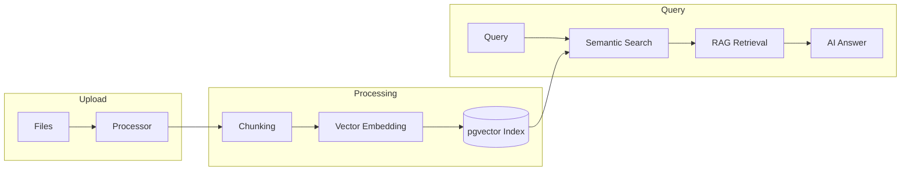

<p align="center">
  
  
  
  
  
</p>

<p align="center">
  <b>English</b> · <a href="README_CN.md">中文</a>
</p>

<h1 align="center">KEngine</h1>
<p align="center"><b>Open-Source Knowledge Base Platform</b></p>
<p align="center"><i>Upload. Organize. Search. Ask. — Your private, self-hosted knowledge engine powered by AI.</i></p>

---

## What is KEngine?

KEngine is a self-hosted, open-source knowledge base platform that transforms your documents into a searchable, AI-augmented knowledge asset. Upload your files, and KEngine automatically processes, chunks, vectorizes, and indexes them — ready for semantic search and AI-powered Q&A.

Your data stays on your infrastructure. Always.

### Why KEngine?

| Problem | Solution |
|---------|----------|
| Scattered documents | Centralized knowledge base with auto-categorization |
| Hard to find information | Semantic search understands meaning, not keywords |
| Manual processing | Auto-chunking and vectorization pipeline |
| Privacy concerns | 100% self-hosted, data never leaves your network |
| High costs | Free, open-source, MIT License |

---

## Core Features

### Document Processing Pipeline



### Key Capabilities

| Feature | Description |
|---------|-------------|
| Document Upload | Upload Markdown and plain text files, auto-processed |
| Smart Chunking | Documents split into optimized chunks |
| Vector Embedding | Each chunk embedded via AI model |
| Semantic Search | Find by meaning, not keywords |
| AI Q&A | Answers grounded in your documents |
| REST API | Full programmatic access |

### System Services

| Service | Port | Role |
|---------|------|------|
| kengine-postgres | 15432 | PostgreSQL 16 + pgvector |
| kengine-redis | 16379 | Cache and queue |
| kengine-app | 18080 | Web UI + REST API |
| kengine-queue | - | Knowledge processing worker |
| kengine-scheduler | - | Task scheduler |

---

## Quick Start

### Prerequisites
Docker 24+, Docker Compose 2.20+, Git 2.30+, AI API Key

### Install
```bash
git clone https://github.com/justmicos/geo-engine.git
cd geo-engine
make dev-setup
# Edit .env -> set AI_API_KEY (required)
make dev-up
```

Windows:
```powershell
.\scripts\setup.ps1
docker compose up -d
```

Open http://localhost:18080/admin

---

## Commands

```bash
make dev-setup     # Setup and configure
make dev-up        # Start services
make dev-down      # Stop services
make dev-logs      # View logs
make dev-status    # Service status
make backup        # Backup database
make privacy-check # Privacy scan
```

## Configuration

| Variable | Required | Default | Description |
|----------|----------|---------|-------------|
| AI_API_KEY | YES | - | AI provider API key |
| AI_API_URL | No | https://api.deepseek.com/v1 | AI API endpoint |
| AI_MODEL | No | deepseek-chat | Model name |
| APP_PORT | No | 18080 | Web UI port |

## License

MIT License
