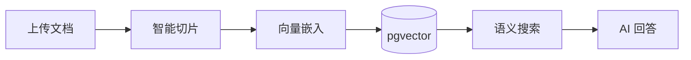

<p align="center">
  
  
  
</p>

<p align="center">
  <a href="README.md">English</a> | <b>中文</b>
</p>

<h1 align="center">KEngine</h1>
<p align="center"><b>开源知识库平台</b></p>
<p align="center"><i>上传 · 整理 · 搜索 · 问答 — 你的私有、自托管、AI 驱动的知识引擎。</i></p>

---

## 什么是 KEngine？

KEngine 是一个自托管的开源知识库平台，将文档转化为可搜索、AI 增强的知识资产。上传文件后自动处理、切片、向量化并建立索引 —— 随时进行语义搜索和 AI 问答。

你的数据永远留在你的基础设施上。

### 文档处理管线



### 功能

| 功能 | 说明 |
|------|------|
| 文档上传 | 支持 Markdown、纯文本，自动处理 |
| 智能切片 | 自动分割为优化块 |
| 向量嵌入 | AI 模型生成向量 |
| 语义搜索 | 按语义查找，非关键词 |
| AI 问答 | 基于知识库内容的智能回答 |
| REST API | 程序化访问接口 |

## 快速开始

```bash
git clone https://github.com/justmicos/geo-engine.git
cd geo-engine
make dev-setup
# 编辑 .env -> 设置 AI_API_KEY（必填）
make dev-up
# 打开 http://localhost:18080/admin
```

## 命令

```bash
make dev-setup     # 安装配置
make dev-up        # 启动服务
make dev-down      # 停止服务
make backup        # 备份数据库
make privacy-check # 隐私扫描
```

## 配置

| 变量 | 必填 | 默认值 | 说明 |
|------|------|--------|------|
| AI_API_KEY | 是 | - | AI 密钥 |
| AI_API_URL | 否 | https://api.deepseek.com/v1 | API 端点 |
| APP_PORT | 否 | 18080 | Web 端口 |

## 许可证

MIT License
