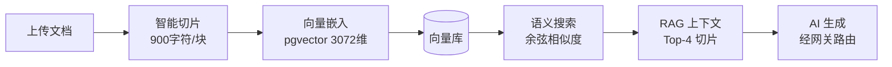
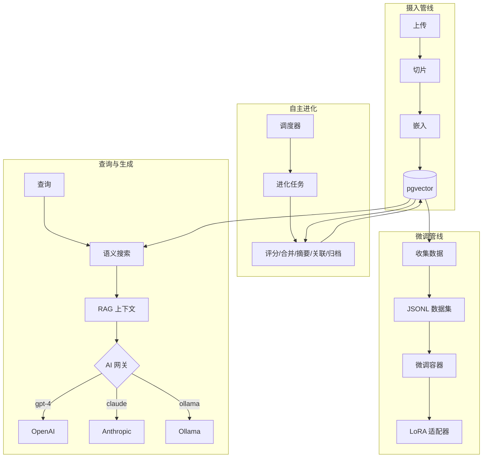

<p align="center">
  
  
  
  
  
</p>

<p align="center">
  <a href="README.md">English</a> · <b>中文</b>
</p>

<h1 align="center">KEngine</h1>
<p align="center"><b>企业级自托管知识引擎</b></p>
<p align="center"><i>多 Provider AI 编排 · 知识自主进化 · 本地模型微调 · 完全数据主权</i></p>

<p align="center">
  <a href="#-概览">概览</a> •
  <a href="#-核心能力">核心能力</a> •
  <a href="#-系统架构">系统架构</a> •
  <a href="#-快速开始">快速开始</a> •
  <a href="#-配置参考">配置参考</a>
</p>

---

## 📋 概览

**KEngine** 是一个企业级自托管知识引擎，将你的文档转化为**持续进化、AI 增强的知识资产**。它集成了自动化文档处理、向量语义搜索、检索增强生成（RAG）和多 Provider AI 网关，一套架构即可完成私有知识基础设施的完整部署。

与绑定单一供应商的知识工具不同，KEngine 实现了**供应商无关的 AI 编排**：通过统一网关连接云端 LLM（OpenAI、Anthropic、Google、DeepSeek 等）和本地推理引擎（Ollama、LM Studio、vLLM），知识库自主进化以持续提升内容质量，内置微调管道让你在私有基础设施上完成领域模型适配。

**数据永不离开你的网络。API Key 永不进入代码。每次 AI 调用均可审计。**

### 适用对象

| 角色 | 价值 |
|------|------|
| **企业团队** | 私有知识库 + RAG 检索 + 多模型管控 + 完整审计链路 |
| **AI/ML 工程师** | 统一网关评估 15+ Provider 效果；基于领域数据完成 LoRA 微调 |
| **内容运营** | 自动化内容生产管线，集成语义检索、知识进化、多站分发 |
| **隐私敏感组织** | 100% 自托管，API Key 加密存储，零数据外泄 |
| **量化/交易团队** | 结构化知识库为量化模型和交易 Agent 提供上下文支撑 |

---

## 🚀 核心能力

### 1. 通用 AI 网关（Universal AI Gateway）

**供应商无关的路由层**，将知识操作与特定 AI 供应商解耦。所有请求通过 `ai-gateway:19090`，基于模型名前缀自动分发到最优 Provider——切换供应商无需修改代码。

| 类别 | 供应商 | 连接方式 |
|------|--------|---------|
| **国际云端** | OpenAI、Anthropic Claude、Google Gemini、DeepSeek、Azure OpenAI、AWS Bedrock | 互联网 |
| **国内云端** | 硅基流动、智谱 GLM、月之暗面 Moonshot、阿里通义 Qwen、百度千帆 | 互联网 |
| **本地引擎** | Ollama、LM Studio、vLLM、LocalAI、llama.cpp | `host.docker.internal` |
| **自定义** | 任何 OpenAI 兼容接口 | 可配置 |

```
┌──────────────┐     ┌─────────────────────────────────────┐
│  GEOFlow     │────▶│        AI Gateway (:19090)           │
│  (Laravel)   │     │                                     │
└──────────────┘     │  gpt-*     ──▶ OpenAI               │
                     │  claude-*  ──▶ Anthropic             │
                     │  gemini-*  ──▶ Google                │
                     │  deepseek* ──▶ DeepSeek              │
                     │  qwen/*    ──▶ 阿里通义千问          │
                     │  glm-*     ──▶ 智谱 GLM              │
                     │  ollama/*  ──▶ Ollama (本地)          │
                     └─────────────────────────────────────┘
```

**核心优势：**
- **故障转移**：Provider 失效时按优先级自动切换到备用模型
- **成本优化**：简单任务路由廉价模型，复杂任务使用高级模型
- **本地优先**：敏感数据走本地模型，峰值容量弹性扩展到云端
- **统一可观测**：单端点管理所有 AI 用量、延迟和审计日志

### 2. 知识库与 RAG 管线

全周期文档摄入与检索链路：



- **智能切片**：段落感知分割，支持可配置重叠
- **双重检索**：pgvector 原生搜索 + 内存混合评分（向量 75% + 词法 25%）
- **嵌入降级**：无可用嵌入 API 时自动回退到哈希伪向量
- **批量向量化**：每次嵌入调用 12 个切片，自动重试

### 3. 知识自主进化（Autonomous Evolution）

知识库缺少维护就会退化。KEngine 的**进化引擎**充当自动化策展人，按可配置周期运行：

| 阶段 | 操作 | 说明 |
|------|------|------|
| 1. **评分** | 质量评估 | AI 对每个切片进行质量、相关性、时效性评分（0–1） |
| 2. **合并** | 去重检测 | Jaccard 相似度检测近似重复切片，标记待审 |
| 3. **摘要** | 内容压缩 | 长切片（>500 字符）自动生成 AI 摘要 |
| 4. **关联** | 交叉引用 | 基于向量余弦相似度发现语义关联 |
| 5. **归档** | 生命周期管理 | 低质量、长期未访问（>90 天）切片自动归档 |

```bash
make evolve-run              # 手动触发一次进化
make evolve-status           # 查看最近运行摘要
```

### 4. 本地模型微调（Fine-Tuning）

将知识库转化为**领域适配模型**，通过 LoRA/QLoRA 微调实现：

```
知识库切片 ──▶ CollectTrainingData ──▶ JSONL 数据集
                     │
               Alpaca / ShareGPT 格式
                     │
              ┌──────▼──────┐
              │ Fine-Tune   │  Unsloth（首选）或 PEFT
              │ 容器        │  GPU 加速（CUDA 12.1+）
              └──────┬──────┘
                     │
              ┌──────▼──────┐
              │ LoRA 适配器 │  可部署到 vLLM / Ollama
              └─────────────┘
```

三种模式：**LoRA**（快速、低内存）、**QLoRA**（4-bit 量化、最小 GPU）、**Full**（最大适配度）。

```bash
make fine-tune-collect       # 从知识库构建训练数据集
make fine-tune-start         # 启动训练
make fine-tune-logs          # 实时监控 loss 与训练指标
```

---

## 🏗️ 系统架构

### 服务拓扑

| 服务 | 层 | 端口 | 依赖 |
|------|-----|------|------|
| **postgres** | 数据 | 15432 | PostgreSQL 16 + pgvector |
| **redis** | 缓存 | 16379 | 队列代理、会话存储 |
| **app** | 应用 | 18080 | Laravel 12、Web UI、REST API |
| **queue** | 工作 | — | AI 生成、知识处理 |
| **scheduler** | 编排 | — | 定时触发器、进化调度 |
| **ai-gateway** | **AI** | **19090** | **FastAPI 多 Provider 路由** |
| **fine-tune** | **AI** | — | **Unsloth/PEFT、需 GPU** |

### 数据流



所有服务绑定 `127.0.0.1`，内部服务无外部端口。API Key 使用 AES-256-CBC 加密存储。

---

## ⚡ 快速开始

### 环境要求
- Docker 24+、Docker Compose 2.20+、Git 2.30+
- 至少一个 AI Provider 的 API Key

### 安装

```bash
git clone https://github.com/justmicos/kengine.git
cd kengine
make dev-setup
# 编辑 .env——设置至少一个 AI Provider 密钥
make dev-up
```

Windows：
```powershell
.\scripts\setup.ps1
# 编辑 .env 文件
docker compose up -d
```

打开 **http://localhost:18080/admin**

### 配置 Provider

**A) AI Gateway 多 Provider 模式（推荐）**
```env
AI_GATEWAY_ENABLED=true
DEEPSEEK_API_KEY=sk-...
OLLAMA_BASE_URL=http://host.docker.internal:11434
```
```bash
make dev-up-gateway
```

**B) 纯本地模式（离线环境）**
```env
AI_GATEWAY_ENABLED=true
OLLAMA_BASE_URL=http://host.docker.internal:11434
OLLAMA_MODEL=qwen2.5:72b
EMBEDDING_PROVIDER=ollama
```

**C) 直连模式（单 Provider）**
```env
AI_GATEWAY_ENABLED=false
AI_API_KEY=sk-...
AI_API_URL=https://api.deepseek.com/v1
AI_MODEL=deepseek-chat
```

---

## 📖 命令参考

### 服务生命周期

```bash
make dev-setup           # 初始化：克隆 GEOFlow、创建 .env
make dev-up              # 启动核心（app、db、redis、queue、scheduler）
make dev-up-all          # 启动所有服务（核心 + gateway + fine-tune）
make dev-up-gateway      # 启动核心 + AI gateway
make dev-down            # 停止所有服务
make dev-logs            # 查看日志
make dev-status          # 容器状态概览
```

### AI Gateway 操作

```bash
make ai-gateway-logs             # 查看网关日志
make ai-gateway-test             # 交互式聊天测试
make ai-gateway-test-embedding   # 测试嵌入端点
make ai-gateway-list-models      # 列出所有可用模型
```

### 知识进化

```bash
make evolve-run                  # 手动触发进化
make evolve-status               # 查看最近 5 次进化摘要
```

### 模型微调

```bash
make fine-tune-collect           # 从知识库提取训练数据
make fine-tune-start             # 启动微调容器
make fine-tune-logs              # 监控训练进度
make fine-tune-list-jobs         # 查看已完成的适配器
```

### 维护

```bash
make backup                      # 全量数据库导出
make build                       # 重构建所有 Docker 镜像
make privacy-check               # 扫描凭据泄露
make clean                       # 清理临时数据
```

---

## 🔧 配置参考

### 核心应用

| 变量 | 默认值 | 说明 |
|------|--------|------|
| `APP_PORT` | `18080` | Web UI 和 REST API 端口 |
| `SITE_NAME` | `KEngine` | 应用显示名称 |
| `POSTGRES_PASSWORD` | `geo_password` | 数据库密码 |
| `DB_EXPOSE_PORT` | `15432` | PostgreSQL 主机端口 |

### AI Provider

所有 Provider 密钥均为可选——仅配置你实际使用的。

| 变量 | Provider | 默认模型 |
|------|----------|---------|
| `OPENAI_API_KEY` | OpenAI | `gpt-4o` |
| `ANTHROPIC_API_KEY` | Anthropic Claude | `claude-sonnet-4-20250514` |
| `GEMINI_API_KEY` | Google Gemini | `gemini-2.5-pro` |
| `DEEPSEEK_API_KEY` | DeepSeek | `deepseek-chat` |
| `AZURE_OPENAI_KEY` + `AZURE_OPENAI_ENDPOINT` | Azure OpenAI | `gpt-4o` |
| `SILICONFLOW_API_KEY` | 硅基流动 | `deepseek-ai/DeepSeek-V3` |
| `ZHIPU_API_KEY` | 智谱 AI | `glm-4-plus` |
| `MOONSHOT_API_KEY` | 月之暗面 | `moonshot-v1-8k` |
| `QWEN_API_KEY` | 阿里通义千问 | `qwen-max` |
| `OLLAMA_BASE_URL` | Ollama | `qwen2.5:72b` |
| `LMSTUDIO_BASE_URL` | LM Studio | `qwen2.5-72b-gguf` |
| `VLLM_BASE_URL` | vLLM | `qwen2.5-72b-instruct` |

### 嵌入模型

| 变量 | 默认值 | 可选值 |
|------|--------|--------|
| `EMBEDDING_PROVIDER` | `openai` | `openai`, `deepseek`, `ollama` |
| `EMBEDDING_MODEL` | `text-embedding-3-small` | Provider 特定的模型 ID |

### 自主进化

| 变量 | 默认值 | 说明 |
|------|--------|------|
| `EVOLUTION_ENABLED` | `true` | 启用定时进化 |
| `EVOLUTION_INTERVAL_HOURS` | `24` | 运行间隔（小时） |
| `EVOLUTION_MODEL` | `deepseek-chat` | 质量评估用模型 |
| `EVOLUTION_MAX_CHUNKS_PER_RUN` | `50` | 每轮处理切片上限 |
| `EVOLUTION_SIMILARITY_THRESHOLD` | `0.85` | 去重余弦阈值 |
| `EVOLUTION_AUTO_PRUNE` | `true` | 自动归档低质量切片 |
| `EVOLUTION_AUTO_MERGE` | `true` | 标记近似重复切片 |
| `EVOLUTION_AUTO_SUMMARIZE` | `true` | 生成长切片摘要 |
| `EVOLUTION_AUTO_LINK` | `true` | 创建交叉引用链接 |
| `EVOLUTION_AUTO_ARCHIVE_DAYS` | `90` | N 天未访问则归档 |

### 微调

| 变量 | 默认值 | 说明 |
|------|--------|------|
| `FINE_TUNE_ENABLED` | `false` | 启用微调管线 |
| `FINE_TUNE_BASE_MODEL` | `Qwen/Qwen2.5-7B-Instruct` | HuggingFace 基模型 |
| `FINE_TUNE_METHOD` | `lora` | `lora`、`qlora` 或 `full` |
| `FINE_TUNE_R` | `16` | LoRA 秩 |
| `FINE_TUNE_ALPHA` | `32` | LoRA 缩放参数 |
| `FINE_TUNE_EPOCHS` | `3` | 训练轮数 |
| `FINE_TUNE_BATCH_SIZE` | `4` | 每设备批次大小 |
| `FINE_TUNE_LEARNING_RATE` | `2e-4` | 峰值学习率 |
| `FINE_TUNE_DATASET_MAX_SAMPLES` | `1000` | 最大训练样本数 |

---

## 📦 项目结构

```
kengine/
├── ai-gateway/                 # 多 Provider AI 路由层
│   ├── server.py               # FastAPI 应用，OpenAI 兼容 API
│   ├── router.py               # 模型名前缀 → Provider 路由
│   ├── config.py               # 环境变量驱动的 Provider 配置
│   ├── providers/
│   │   ├── base.py             # 抽象 Provider 接口
│   │   ├── openai_compatible.py # OpenAI、DeepSeek、Ollama 等
│   │   ├── anthropic.py        # Claude Messages API 翻译器
│   │   └── google.py           # Gemini API 翻译器
│   └── Dockerfile
├── fine-tune/                  # 本地模型微调管线
│   ├── fine_tune.py            # 编排器：Unsloth → PEFT 回退
│   ├── dataset.py              # JSONL 加载、Alpaca/ShareGPT 格式化
│   ├── recipes/lora.yaml       # 默认训练配方
│   └── Dockerfile
├── patches/                    # GEOFlow 应用扩展
│   ├── app/
│   │   ├── Jobs/EvolutionJob.php
│   │   ├── Console/Commands/EvolutionCommand.php
│   │   ├── Console/Commands/CollectTrainingDataCommand.php
│   │   └── Services/GeoFlow/KnowledgeEvolutionService.php
│   └── config/geoflow.php
├── config/                     # Nginx、目标站点代理
├── scripts/                    # 跨平台安装与维护
│   ├── setup.sh / setup.ps1
│   ├── apply-patches.sh/.ps1
│   ├── backup.sh
│   └── health-check.sh
├── seed/                       # 示例知识库
├── .env.example                # 完整配置模板
├── docker-compose.yml          # 服务编排（7 个服务）
├── Makefile                    # 命令入口
└── ARCHITECTURE.md             # 系统设计文档
```

---

## 📄 许可证

MIT License——详见 [LICENSE](LICENSE) 文件。

---

<p align="center">
  <sub>基于 <a href="https://github.com/yaojingang/GEOFlow">GEOFlow</a> 构建 · 自托管 · 私有 · MIT 开源</sub>
</p>
