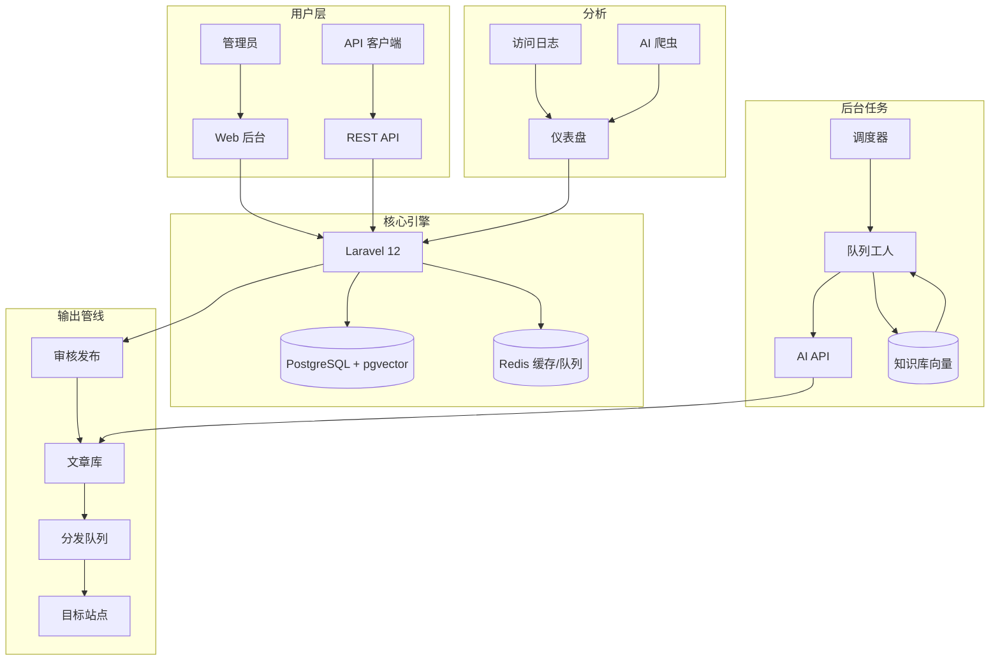
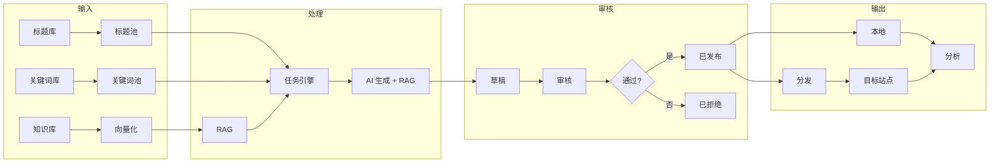
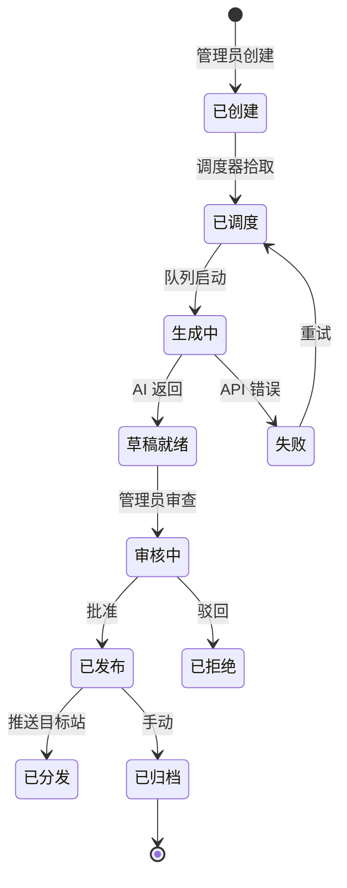

# GEOEngine — GEO 内容工程基础设施

[]()
[]()
[]()
[]()
[]()

> [English](README.md) | **中文**

**知识沉淀 → AI 生成 → 审核发布 → 多站分发 → 效果追踪** — 将可信知识转化为可管理、可发布、可追踪、可同步到多端的 GEO 内容资产。

---

## 系统架构



## 端到端工作流



## 任务生命周期



## 功能

### 知识引擎
上传文档 → 自动切片 → 向量嵌入 → pgvector 存储 → RAG 召回 → AI 生成

### 内容工厂
| 模块 | 功能 |
|------|------|
| 标题库 | AI/手动标题，智能采样 |
| 关键词库 | SEO 关键词分组 |
| 图片库 | 图片管理，自动同步 |
| 任务自动化 | 定时生成 + 审核关卡 |

### 分发网络
创建渠道 → 生成目标包 → 部署 Agent → 内容推送 → 健康监控

## 快速开始

```bash
git clone https://github.com/justmicos/geo-engine.git
cd geo-engine
# 编辑 .env → 设置 AI_API_KEY
make dev-setup
make dev-up
# 打开 http://localhost:18080/geo_admin
```

## 配置

| 变量 | 必填 | 默认值 | 说明 |
|------|------|--------|------|
| AI_API_KEY | **是** | - | AI API 密钥 |
| AI_API_URL | 否 | https://api.deepseek.com/v1 | AI 端点 |
| AI_MODEL | 否 | deepseek-chat | 生成模型 |
| APP_PORT | 否 | 18080 | Web 端口 |

## 许可证

MIT License
